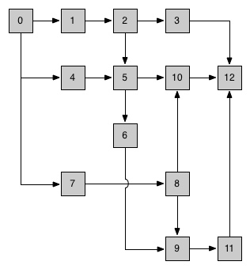

# Motivation

The process of building a project can be very much more complicated than you can imagine. Look at the following graph:

This could exist in reality.

Grunt's tasks require reading/writing files, which bring tedious directory-making/removing and heavy disk IO. It's difficult to tell a specific executing process from _gruntfile.js_.

Gulp is much better, file contents is transmited in [Stream](https://nodejs.org/dist/latest-v6.x/docs/api/stream.html) from plugin to plugin. Chained process definition is much more intelligible. But:
 
 - Gulp cannot make sure a file is read once at most in a building lifecycle
 - Gulp caches results in tasks but not files, which leads to many meaningless work
 - Gulp do not snap the "left" files, which are hard to selected

 Panto is trying to fixed these issues.